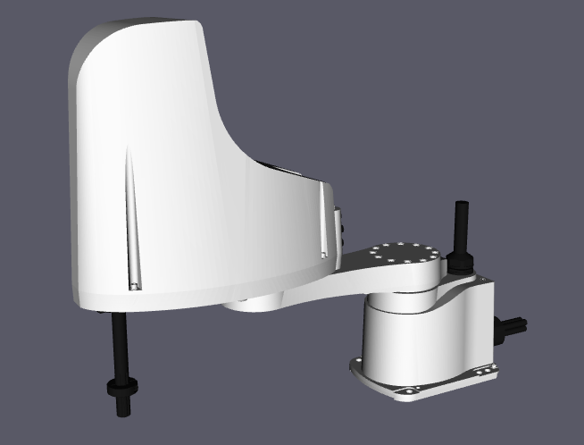
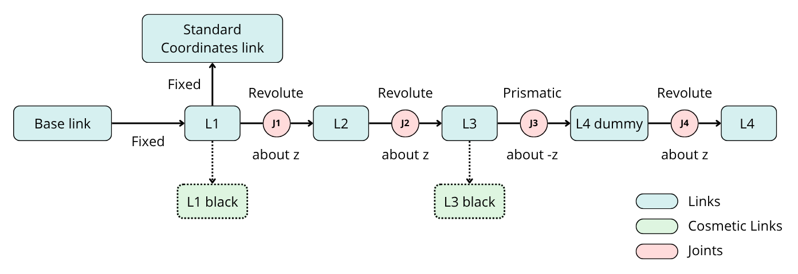
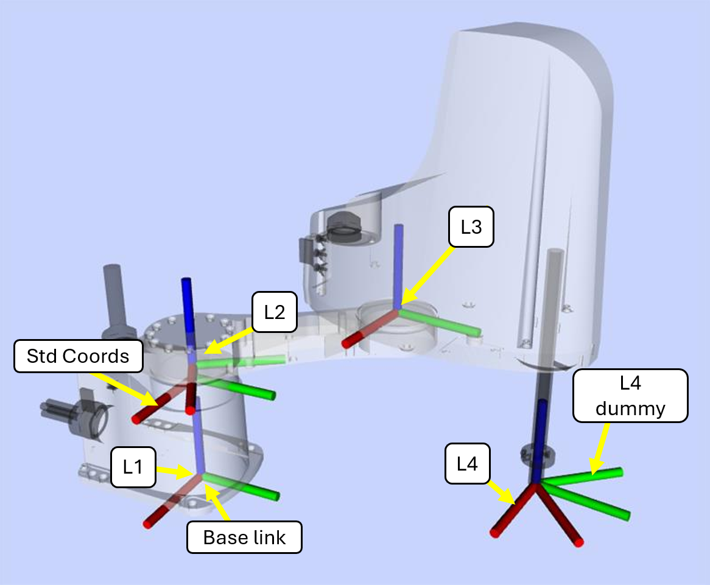
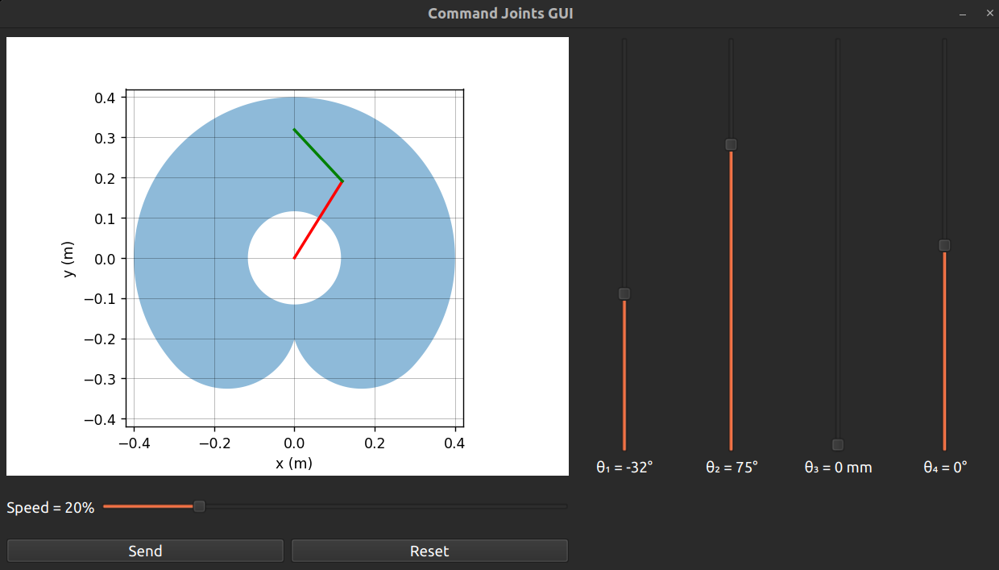
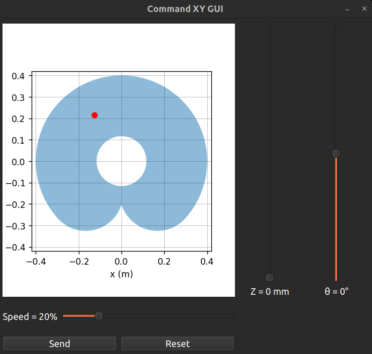
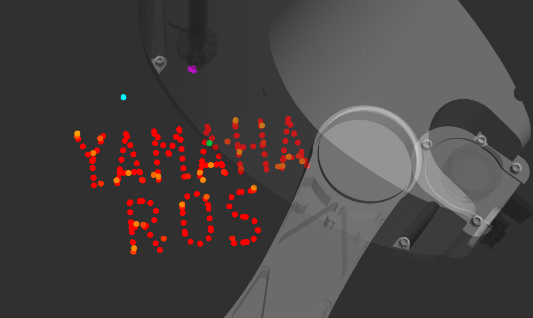

# Yamaha YK400XE ROS 2
This package provides tools to use Yamaha YK400XE robot and RCX340 controller with ROS2  

<p align="center">
    <a href="" rel="noopener">
    </a>
    <br>
    <em>Figure 1 — Robot model displayed in RViz</em>
</p>  

| ROS 2 Distribution  |                             Status                                |
|:-------------------:|:-----------------------------------------------------------------:|
|       Humble        |   |
|       Jazzy         |   |
|       Kilted        |  |


> [!NOTE]  
> This work is not affiliated with or endorsed by Yamaha Motor Co., Ltd. It is an unofficial project intended to help integrate the Yamaha YK400XE and RCX340 with the ROS 2 ecosystem. It is not perfect, so use at your own risk ! (If something goes wrong, we've never met)  
> For a better understanding of the RCX340 controller and Yamaha robot programming, I also recommend watching the [RCX340 Programming Youtube playlist](https://www.youtube.com/playlist?list=PL6ZN-QpRY5vN7q5gdD1X8s_dOcdRP6GeR) and reading the official RCX340 and YK400XE documentation.
> It is assumed that the robot standard coordinates have already been calibrated, with the Y axis pointing toward the front of the robot and the X axis pointing to the right.

This project features :  
- ROS 2 interface for Yamaha YK400XE
- Communication support for RCX340 controller
- Joint state publishing
- Motion command interface
- Launch files and example configurations

## Content
- [Setup](#setup)
  - [Installation](#installation)
  - [Configuration](#configuration)
  - [Running the Robot](#running-the-robot)
- [Usage](#usage)
  - [Coordinate Frames](#coordinate-frames)
  - [MOVE Commands](#move-commands)
  - [Publishers](#publishers)
  - [Services](#services)
- [GUI Control](#gui-control)
  - [Joint Values GUI](#joint-values-gui)
  - [Standard Coordinates GUI](#standard-coordinates-gui)
- [Examples of Applications](#examples-of-applications)
  - [Draw YAMAHA](#draw-yamaha)
  - [Pick and Place](#pick-and-place)

## Setup
This project uses TCP/IP to communicate with the RCX340 controller. Make sure to Ethernet communication is enable on the controller using the Programming Box, and configure your computer IP address accordingly.  
The Programming Box path to communication settings is :  
`Settings ⭢ Communication Settings ⭢ Ethernet ⭢ ONLINE`

### Installation 
Open a terminal the __src__ folder of your ROS 2 workspace and clone the repository :
```bash
git clone https://github.com/Sappy27/yk400xe_ros2.git
```
Then return to the root of your workspace and build the package :
```bash
cd .. && colcon build --symlink-install
``` 
Source your workspace :  
```bash
source install/setub.bash
``` 
### Configuration
Open the `.yaml` configuration file and set the __controller IP address and port__. These values can be found in the RCX340 Programming Box communication settings.
```bash
nano ./src/yk400xe_ros2/rcx340_bringup/config/params.yaml 
```
(or use any other text editor you prefer)  
  
Then build again your workspace :
```bash
colcon build --symlink-install
``` 
Source your workspace :  
```bash
source install/setub.bash
``` 
### Running the robot
Make sure the `Manual Lock` switch on the Programming Box is set to `OFF`. Otherwise, some commands will be rejected by the controller.  
After sourcing your workspace (if not already done), run : 
```bash
ros2 launch rcx340_bringup bringup.launch.py
```
This command initializes the communication between the PC and the controller of the robot.  
You should see a message saying, "Welcome to RCX340". If not, check the LAN connnection between the PC and the controller, and the Ethernet parameters of the computer.  

In a second terminal, run :  
```bash
ros2 launch yk400xe_description robot_description.launch.py  
```
This command starts the robot description to be able to visualize and use the robot model, links and joints. A Rviz window should 
open and you should be able to see the robot. Verify that the position visible in Rviz is the same as the real robot.

After checking that the emergency stop is OFF, use another terminal to realize an alarm reset and to start the servos :  
```bash
ros2 service call /command/alarm_reset std_srvs/srv/Empty
```
```bash
ros2 service call /command/servo std_srvs/srv/SetBool "data: true"
```
If everything is alright, you should hear the sound of the motors turning ON.

## Usage
This section describes how the implementation is designed and how to use the repository for your own applications.
### Coordinate Frames
The kinematic chain graph of the robot is shown in __Figure 2__. In the controller standard coordinate frame, the positive __Z axis__ point downward__. However, with the current X and Y axis orientation,this does not form a __right-handed coordinate system__. To ensure consistency with __ROS conventions__, the __Z axis__ direction is inverted in ROS so that positive Z points upward. The Z direction is inverted both when receiving and sendin position communications with the controller, ensuring coherent coordinate frames on both sides. 
Otherwise, the positive direction of all four joints is kept the same as defined by the controller.  
The `L1_black` and `L3_black` links are purely cosmetic and have no functional purpose.
<p align="center">
  <a href="" rel="noopener">
  </a>
  <br>
  <em>Figure 2 — Kinematic chain of the YK400XE robot</em>
</p>  

<p align="center">
  <a href="" rel="noopener">
  </a>
  <br>
  <em>Figure 3 — YK400XE TF frames displayed in RViz</em>
</p>  

### MOVE Commands
In the Yamaha robot programming language, robot motion commands are executed using MOVE commands. There are four different types :
- `MOVE P` : point-to-point motion in joint space
- `MOVE L`: linear interpolation in Cartesian space
- `MOVE C` : circular interpolation motion
- `MOVEI` : incremental motion (the given position is interpreted as an offset increment rather than an absolute spatial position)

To implement these commands in this ROS 2 port, service and message interface have been created.  
  
The Move.msg interface is defined as follows :  

| Field         | Type         |                     Description                       |
| ------------- | ------------ | ----------------------------------------------------- |
| `move_type`   | `int8`       | Motion type (`P=1`, `L=2`, `C=3`, `I=4`)              |
| `coords_type` | `int8`       | Coordinate type (`0=Standard Coordinates`, `1=Pulse`) |
| `pose`        | `float64[4]` | Target pose: `[x, y, z, thz]` or `[j1, j2, j3, j4]`   |
| `pose2`       | `float64[4]` | Second target pose used for `MOVE C`                  |
| `speed`       | `int8`       | Motion speed parameter (`S` for MOVE P, `VEL` for MOVE L and MOVE C) |  
| `do_arch`     | `bool`       | Enable arch motion (for move_type=P only)             |
| `arch`        | `float64[3]` | Arch parameters: `[z_height, x_width, y_width]`       |
| `cont`        | `bool`       | Start next motion before reaching target  (CONT)      |
| `wait_arm`    | `bool`       | Wait for the robot to reach the target position (WAIT_ARM) |
  
The `MoveTrajectory.srv` service takes an array of `Move.msg`, allowing multiple motions to be queued and executed sequentially.  
  
### Publishers
The following ROS 2 topics are available.  
These topics provide information about the current state of the robot and the controller.  

|           Topic            |          Message Type           |             Description               |                            Values                            |
|----------------------------|---------------------------------|---------------------------------------|--------------------------------------------------------------|
| `/joint_states`            | `sensor_msgs/msg/JointState`    | Current robot joint states            | `[J1,J2,J3,J4]` in rad or m                                  |
| `/ee_state`                | `geometry_msgs/msg/PoseStamped` | End-effector pose                     | `[x,y,z,thz]` end-effector pose in standard coordinate frame |
| `/status/alarm`            | `std_msgs/msg/String`           | Current controller alarm message      | `gg.bb : error_text`                                         |
| `/status/emergency_stop`   | `std_msgs/msg/Bool`             | Emergency stop state                  | `true` = emergency stop active                               |
| `/status/mspeed`           | `std_msgs/msg/Int8`             | Controller motion speed percentage    | `1 → 100`                                                    |
| `/status/return_to_origin` | `std_msgs/msg/Int8MultiArray`   | Return-to-origin status for each axis | `0` or `1` for each axis                                     |
| `/status/motor`            | `std_msgs/msg/Int8`             | Motor power state                     | `0=OFF`, `1=ON`, `2=ON+SERVO`                                |
| `/status/servo`            | `std_msgs/msg/Int8MultiArray`   | Servo status for each axis            | `0` or `1` for each axis                                     |
| `/status/mode`             | `std_msgs/msg/Int8`             | Current controller mode               | `-1=RESTRICTED`, `0=MANUAL`, `1=AUTO`, `2=RELEASE`           |


### Services
The following ROS 2 services are available for robot control and controller interaction.

|         Service        |              Service Type               |                          Description                          |
|------------------------|-----------------------------------------|---------------------------------------------------------------|
| `/command/move`        | `yk400xe_interfaces/srv/MoveTrajectory` | Execute a trajectory composed of multiple `Move.msg` commands |
| `/command/servo`       | `std_srvs/srv/SetBool`                  | Turn the robot servos ON or OFF                               |
| `/command/alarm_reset` | `std_srvs/srv/Empty`                    | Reset the current controller alarm                            |


## GUI Control
Two Graphic User Interface (GUI) are available. One sends commands using joints values, and one sends command using standard coordinates.
To control the robot using either of the GUI, start by following sections [Running the robot](#running-the-robot).
> [!NOTE]  
> For initial tests, keeping a speed under 20% is recommended.

### Joint Values GUI
This interface allows to control the position of all four joints. The units of joints J1, J2 and J4 are degrees (°) and the unit of the joint J3 is millimeters (mm).  

<p align="center">
  <a href="" rel="noopener">
  </a>
  <br>
  <em>Figure 4 — Joint Values GUI</em>
</p> 
  

Open a new terminal and run :  
```bash
ros2 run yk400xe_control gui_command_joints.py
```

### Standard Coordinates GUI
This interface allows to control the position of the end effector position `(x,y,z,th)`` in millimeters mm for x,y and z, and degrees ° for th.  

<p align="center">
  <a href="" rel="noopener">
  </a>
  <br>
  <em>Figure 5 — Standard Coordinates GUI</em>
</p> 

Open a new terminal and run :  
```bash
ros2 run yk400xe_control gui_command_xy.py 
```

## Examples of Applications
This section presents example of usage of the robot commands directly from the code.

### Draw YAMAHA
This example shows how to use the different MOVE commands to make the robot end effector follow a desired motion. The code uses 3 motions types `(P,L,C)`, with or without Arch movement. For more details concerning the usage of MOVE command, refer to the previous part [MOVE Commands](#move-commands).  
The example also publish the end effector positions in the form of a point cloud. To observe it, start `Rviz` and add a Pointcloud2 subscribing to the topic `/draw_pc`.  
Before running this example, ensure that nothing and no one is in the path of the robot, and be ready to trigger the emergency stop in case of problem.  

To run this example, start by following section [Running the robot](#running-the-robot). 
Then run the command :  
```bash
ros2 run yk400xe_examples draw_yamaha_ros
```
<p align="center">
  <a href="" rel="noopener">
  </a>
  <br>
  <em>Figure 6 — Draw Yamaha ROS example</em>
</p> 

Then follow the instruction given in the terminal. 

### Pick and Place
This example shows how to perform a pick and place task (without gripper) using the MOVE commands and the end effector position subscription. You can use this example to integrate your own grasping method (vacuum gripper, finger gripper, etc).  
Before running this example, ensure that nothing and no one is in the path of the robot, and be ready to trigger the emergency stop in case of problem.  
To run this example, start by following sections [Running the robot](#running-the-robot).
To perform the pick and place task run :  
```bash
ros2 run yk400xe_examples pick_n_place
```
Then, following the instructions displayed in the terminal :
- Place the robot manually in its `HOME` position and press __ENTER__  
- Place the robot manually in its `PICK` position and press __ENTER__
- Place the robot manually in its `PLACE` position and press __ENTER__  

Finally, after ensuring again that nothing and no one is in the way of the robot, press __ENTER__ to run the task. Once the task is finished, you can press ENTER to repeat it with the same `HOME`,`PICK` and `PLACE` positions.

## License
